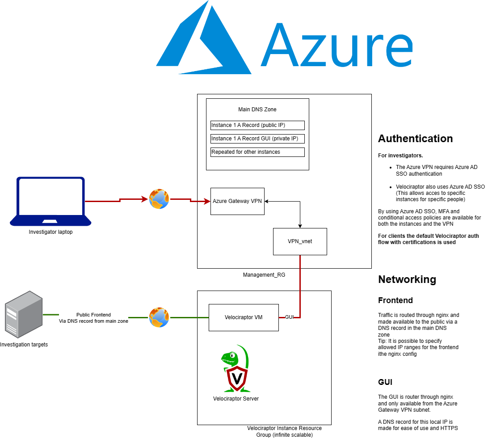

# VelociDeploy-o-Matic (NOVPN version)

Quick n scaleable velociraptor deployment using Azure VPN, for the story behind this Repo please read [my blog](https://blog.wesselhissink.nl/networking/velocideploy-o-matic-the-story/), the blog also contains a walkthrough through all the 'steps' in the code.

# NOVPN version
This version is a branch of the [main branch](https://github.com/WesSec/VelociDeploy-o-Matic), but does not contain a VPN config, instead the GUI is exposed to the internet, but has an option for IP allowlisting using the nginx config.

Other differences:  
- Instead of a subdomain being used, a domain will be generated in the public ip definition. 
	- This adds some extra security (as its harder to enumerate velociraptor instances)
	- I did consider just using IP's, which would make it harder to use nginx, or I should've switched to subdirs instead.

# Topology

The topology makes sense to me, but probably not to you while visiting this repo. So I drew it out for you:

### Set up the Oauth APP

For Velociraptor to authenticate its users, an app registration in Azure is needed. 
1. Create an app with the name "Velociraptor", leave the defaults and set no Redirect URI (This is handled automatically in the script)
2. You can create a secret already (Secret Value is needed later)

----------------------------------- 

## Deployment
1. Make sure all steps above are completed
2. Install dependencies
	- [Terraform](https://developer.hashicorp.com/terraform/tutorials/azure-get-started/install-cli)
	- [Ansible](https://docs.ansible.com/ansible/latest/installation_guide/intro_installation.html)
	- [Azure CLI](https://learn.microsoft.com/en-us/cli/azure/install-azure-cli-linux?pivots=apt)

3. `az login` with an account that can create Resource groups and resources (Remember to select the right subscription if you deploy in an enterprise environment, I suggest using a new/clean subscription for this)
4. `terraform init`
5. Doublecheck `variables.tf` for mistakes (there's not a lot of error handling in this codebase).
6. `terraform plan`
7. Debug any issues.
8. `terraform apply`
9. After deployment, you can find your velociraptor instance by visiting the public_domain shown in the terminal output with `/gui` appended. A reminder that this only works from a VPN-connected endpoint.
	- You can also verify by visiting the public endpoint (public_domain in terminal output) on the `/server.pem` path, which should return a certificate if Velociraptor is running

`id.rsa` should give you ssh access to the machine to finetune/update/whatever, username is: `management` (unless set differently in `variables.tf`)

Every next instance should be deployed from a new git clone of the repository, the `tfstate` files are used by Ansible for determining what to destroy.

# Obtaining the client installer
A todo is to automatically generate a .msi to distribute. Till that time you can generate a MSI containing the correct config via the webUI and the `Server.Utils.CreateMSI` artifact and download it for distribution. For custom MSI with signing options please visit the [Velociraptor documentation](https://docs.velociraptor.app).

# FAQ / Known issues
See [main branch](https://github.com/WesSec/VelociDeploy-o-Matic) for overview of global FAQ/Issues, these below are specific for the NOVPN config

- None currently, if you have any issues open a GitHub

-------------------------

If you benefited from my code, you can sponsor me a 🍺 [over here](https://bmc.link/wessec).  