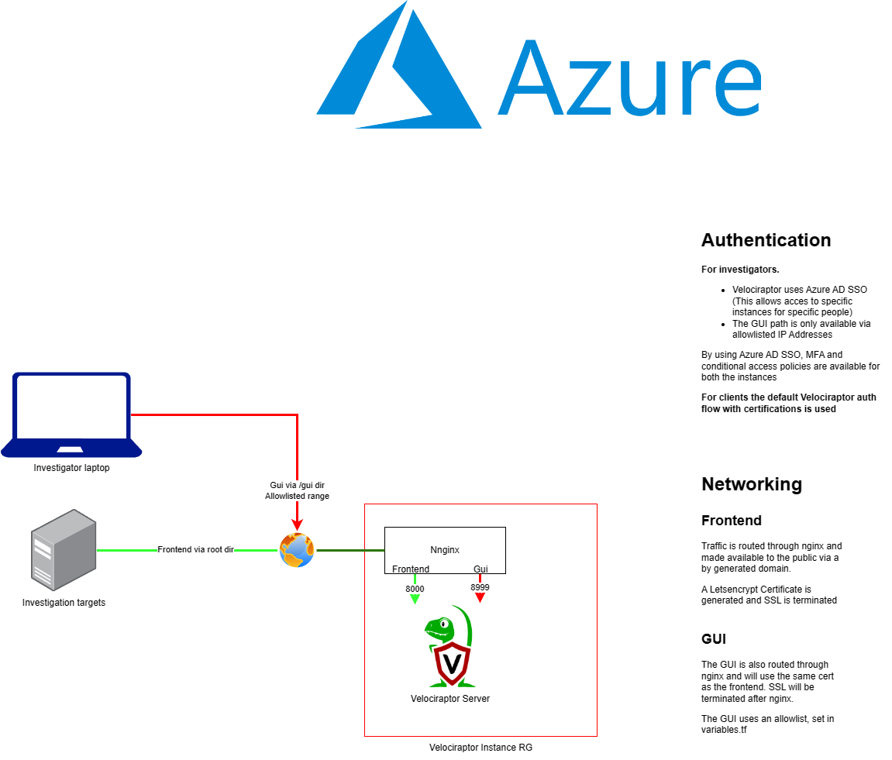

# VelociDeploy-o-Matic

Quick n scaleable velociraptor deployment using Azure VPN, for the story behind this Repo please read [my blog](https://blog.wesselhissink.nl/networking/velocideploy-o-matic-the-story/), the blog also contains a walkthrough through all the 'steps' in the code.

## Alternative: NOVPN version

Since this setup is pretty specific, I created a 'lite' version that does not require a management resource group, a registered domain and VPN. This can save a lot in the effort needed to set up (and costs), especially in lab environments. For this version and documentation visit the [novpn branch](https://github.com/WesSec/VelociDeploy-o-Matic/tree/novpn).

# The Idea

The goal of this project was to create an automated flow for incident responders to quickly fire up a new ready-to-use environment of Velociraptor (in Azure). During engagements, you don't want to spend the repetitive setup tasks over and over again.

🚀🚀🚀The code is now able to do this all in under 3 minutes 🚀🚀🚀

I have never used Terraform and Ansible before, so figuring it out was quite the learning curve, bear with me if there are some best practices skipped along the way.

IMO the config is use-ready and safe enough for smaller/medium-size engagements, but do your own testing and there's no accountability. Feel free to use parts of this codebase for your implementation.

# Topology

The topology makes sense to me, but probably not to you while visiting this repo. So I drew it out for you:

# Structure
The idea exists in 2 parts, which I will explain below (or check the blog for in-depth information).

## Management Resource Group (Persistent throughout instances)

The management resource group contains the DNS Zone and VPN config, these should be persistent throughout various instances of velociraptor. Deployment of this requires some manual steps. In most use cases you would only need to set this up once, therefore automation is not a priority. Following the steps setup should be fairly simple

----------------------------------- 

### Requirements
- An Azure environment with an active subscription (30-day trial account with 200$ of free credits worked for development)

### Deployment

1. Deploy `management.json` (in the templates folder) using the "Deploy a custom template" blade in Azure. Create a new Resource group for it, I suggest `Management_RG`, but you can use what you like.
	- I've observed failing deployments a few times, the best is just to manually remove the Resource Group and retry deployment.
	- If you change the name of the Resource Group, make sure to edit it in `variables.tf` later on.
2. Don't forget to set your domain and Azure tenant ID in the variables
3. Deploy :)
4. Get some coffee as VPN deployment takes a while. There's enough to configure ahead, you can already continue setting the nameservers, granting VPN permissions and creating the app registration. You can also already continue setting the variables in the next part.
5. **Set the nameservers of your domain to the nameservers of Azure**, the nameservers be found in the Outputs tab of the deployment or in the DNS zone itself.
6. Download the VPN package from the Azure website (Resource groups > Management group > VPN > "Download VPN Client")
7. Download the Azure VPN client from the [Microsoft store](https://apps.microsoft.com/store/detail/azure-vpn-client/9NP355QT2SQB?hl=en-us&gl=us)
	- I think you can also use alternative VPN clients, but this is not tested
8. Grant admin consent for the Azure VPN app to your tenant (This must be done with a global admin account) via [this link](https://login.microsoftonline.com/common/oauth2/authorize?client_id=41b23e61-6c1e-4545-b367-cd054e0ed4b4&response_type=code&redirect_uri=https://portal.azure.com&nonce=1234&prompt=admin_consent)
9. Load the config downloaded in step 6 in the VPN client on the analysis machine (Import the azurevpnconfig.xml)
10. Verify the connection

For debugging the Azure gateway vpn check this documentation: https://learn.microsoft.com/en-us/azure/vpn-gateway/openvpn-azure-ad-tenant

-----------------------------------
  ⚠️ Before continuing, check if the nameservers have been propagated with https://dnschecker.org/#NS/\<yourdomain>, otherwise deployment may fail

----------------------------------- 

### Set up the Oauth APP

For Velociraptor to authenticate its users, an app registration in Azure is needed. 
1. Create an app with the name "Velociraptor", leave the defaults and set no Redirect URI (This is handled automatically in the script)
2. You can create a secret already (Secret Value is needed later)

# Velociraptor Instance Resource Group(s) (Destroyable)

This resource group will contain a single VM with an instance of Velociraptor. By doing this, we know that data/information for a single case is held inside that Resource group. When done, we can remove the whole resource group, making sure that no data is left behind or getting mixed up with others.

⚠️Deploy from a Linux-based OS (I think Mac should work), as some bash scripts are being executed during deployment bare Windows does not work.   
⚠️I developed and tested with an Ubuntu distro using WSL (while files reside on my Windows machine), this can give some file permission issues, see #FAQ below for a fix for this, but I suggest running everything from Linux.

----------------------------------- 

## Prepare configuration

Multiple variables must be set in order to have SSO login etc working, this part walks you through these, take caution and **don't skip**.

- In `variables.tf`, you can leave a lot on default, but make sure to check the following variables.
	- `ssh-allowed-ip` sets the IP address which is allowed to SSH to the machine for debugging purposes. You have to disable SSH in Azure if you don't like ssh at all.
	- `dns_domain` should be the same domain as you deployed in Azure.
	- `default_velo_user` should be the email address of a user in your Azure AD tenant, an account for this user will be created in Velo, additional users can be added later via SSH or the WebUI, see [Velociraptor documentation](https://docs.velociraptor.app/artifact_references/pages/server.utils.adduser/)
	- `app_clientid` This is the 'Application (client) ID' and can be found in your Velociraptor App registration which you created earlier
	- `app_clientsecret` is the value for your secret, you can create a secret in your app registration under Certificates & Secrets 
	- `tenantID` This is your Azure TenantID, which can be found in the tenant properties blade.
	- `le_email` An email address is needed for LetsEncrypt to generate certificates

----------------------------------- 

## Deployment
1. Make sure all steps above are completed
2. Install dependencies
	- [Terraform](https://developer.hashicorp.com/terraform/tutorials/azure-get-started/install-cli)
	- [Ansible](https://docs.ansible.com/ansible/latest/installation_guide/intro_installation.html)
	- [Azure CLI](https://learn.microsoft.com/en-us/cli/azure/install-azure-cli-linux?pivots=apt)

3. `az login` with an account that can create Resource groups and resources (Remember to select the right subscription if you deploy in an enterprise environment, I suggest using a new/clean subscription for this)
4. `terraform init`
5. Doublecheck `variables.tf` for mistakes (there's not a lot of error handling in this codebase).
6. `terraform plan`
7. Debug any issues.
8. `terraform apply`
9. After deployment, you can find your velociraptor instance by visiting gui.\<randomstring>.\<domain>, which should be printed in your terminal after deployment. A reminder that this only works from a VPN-connected endpoint.
	- You can also verify by visiting the public endpoint (public_domain in terminal output) on the /server.pem path, which should return a certificate if Velociraptor is running

`id.rsa` should give you ssh access to the machine to finetune/update/whatever, username is: `management` (unless set differently)

Every next instance should be deployed from a new git clone of the repository, the `tfstate` files are used by Ansible for determining what to destroy.

# Obtaining the client installer
A todo is to automatically generate a .msi to distribute. Till that time you can generate a MSI containing the correct config via the webUI and the `Server.Utils.CreateMSI` artifact and download it for distribution. For custom MSI with signing options please visit the [Velociraptor documentation](https://docs.velociraptor.app).

# FAQ / Known issues

## VM Specs/ Disk sizing
- You can edit the VM Specs in `main.tf`. By default, a `Standard_B2s` VM is used, which is more than sufficient for smaller cases, lab, and testing purposes.
- The disk size defaults to 30GB, but you can edit it in `main.tf` to meet your requirements.

## Warning: Unprotected private key file (using WSL)
- If you encounter the "Unprotected private key file" error when using WSL, try the following steps:
  - Follow this guide: [Fixing Unprotected Key File When Using SSH or Ansible Inside WSL](https://www.schakko.de/2020/01/10/fixing-unprotected-key-file-when-using-ssh-or-ansible-inside-wsl/)
  - Run `chmod 600` on `id_rsa`
  - Run the `setup.sh` file again (refer to the log for exact commands). Since this is the last step in the process, you can manually execute these commands.

## Error "No package matching 'nginx' is available"
- just rerun terraform apply, sometimes it bugs out

## Error when destroying the last Velociraptor instance
- Currently, there is no convenient way to remove the last redirect URI from the enterprise application. If you consider this a security risk, you can manually delete it.

## Can I also run this without the VPN setup?
- Currently, no, although I trust the Velociraptor devs, I would strongly advise never exposing the GUI to the big ugly web.
- You can if you modify the files so the VM will get its own vnet instead of joining the VPN one. You should also modify the nginx config and DNS records accordingly.

## How much does it cost to run in Azure?
- This depends on the traffic throughput, while developing I stayed under a daily cost of €1 per day, the biggest cost maker will be the VPN, so keep that in mind.
- Because you have separate resource groups per case, it is very easy to determine costs for the engagement

## I want to run in another region than west-Europe
- This is possible by grepping for all west-europe instances and changing them. Please double-check if the VM image specified in `main.tf` is available in that region

## Issue with X
- If you encounter an issue with X, please create an issue, and I'll try to help you resolve it.
- The code is very fragile, so expect to break everything by changing values

## Why didn't you do Y? It is a better practice.
- [Read my blog](https://blog.wesselhissink.nl/networking/velocideploy-o-matic-the-story/), where I walk you through my story of creating this and provide more information on the process
- This project aimed to minimize the time required to set up a Velociraptor instance for every engagement. When starting, I had limited knowledge about Terraform and Ansible, so please bear with the spaghetti code.
- If you have a good improvement, feel free to create a pull request. Any help is appreciated.

## I need help setting this up in my corporate environment
- HMU via one of my socials

-------------------------

If you benefited from my code, you can sponsor me a 🍺 [over here](https://bmc.link/wessec).  
Shoutout to these contributors:
- [@Mixxedup](https://twitter.com/Miixxedup)
- [@0xW4DDLE](https://twitter.com/0xW4DDLE)